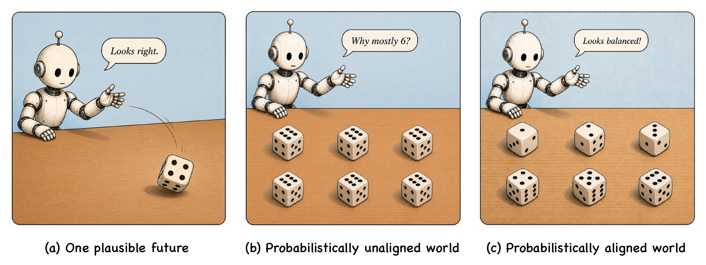
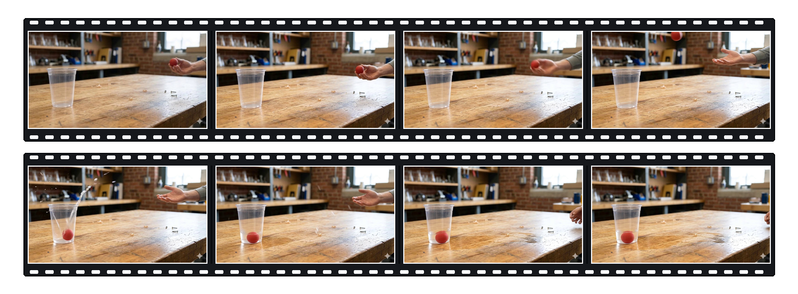
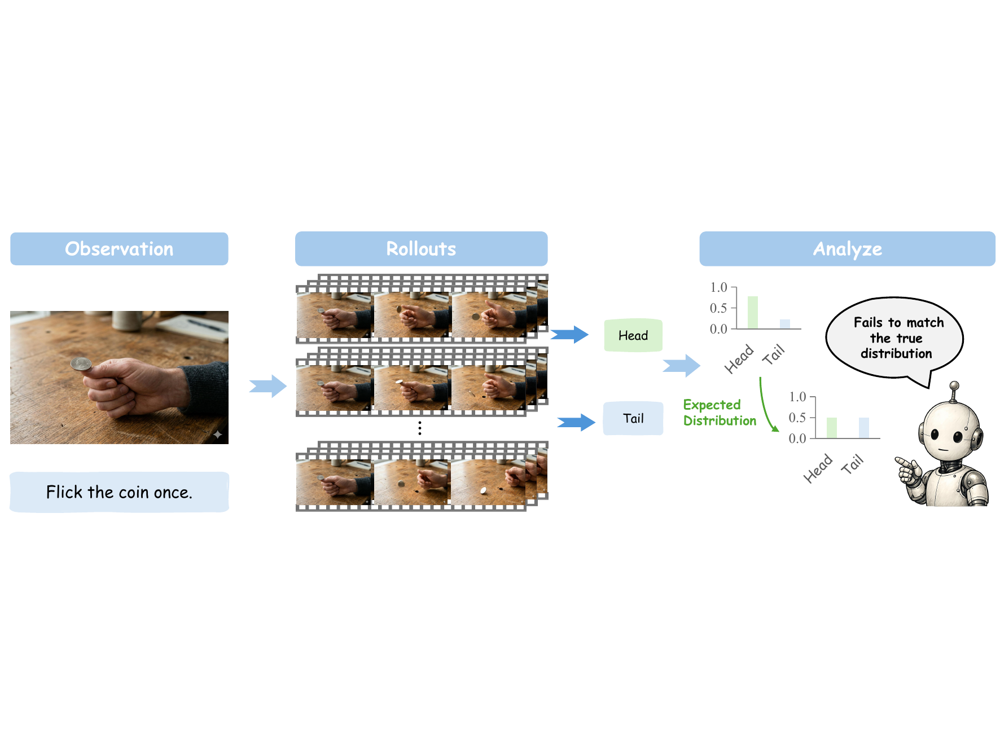
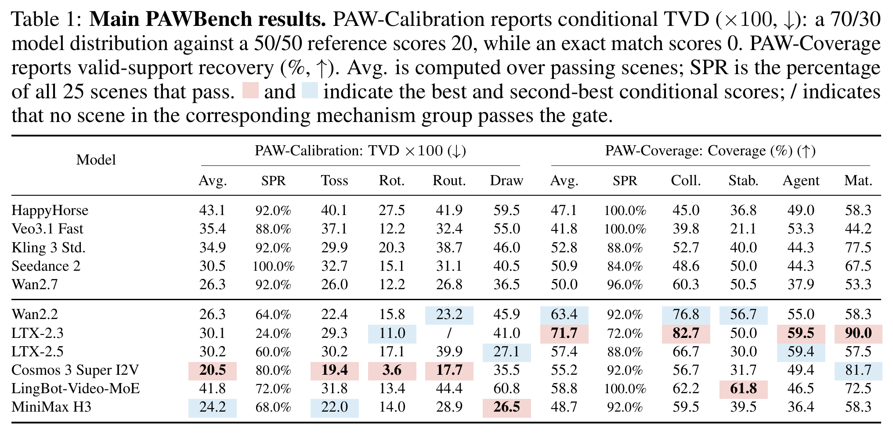

# PAWBench: How Far Are We from Probabilistically Aligned World Modeling?

<p align="center">
  <a href="#citation">
    
  </a>
  <a href="#citation">
    
  </a>
  <a href="https://huggingface.co/datasets/Andrew613/PAWBench">
    
  </a>
</p>

> [!WARNING]
> **Pre-release repository.** The evaluator and benchmark data are available for review. Paper links, the project page, and the public leaderboard will be added with the release.

## Overview

Physical processes are stochastic: the same action can end in more than one
valid state. PAWBench therefore asks whether a video generator reproduces a
*distribution* of physical outcomes across repeated rollouts, not whether it
can produce one convincing video.



PAWBench fixes the source image and action, samples 50 videos, and evaluates the
resulting distribution of physical outcomes.

| Track | Question | Metric |
| --- | --- | --- |
| **PAW-Calibration** | Are outcome frequencies correct? | TVD (lower is better) |
| **PAW-Coverage** | Are all supported outcomes observed? | Coverage (higher is better) |

The benchmark contains 50 scenes: 25 PAW-Calibration and 25 PAW-Coverage.
It ships 100 reviewable rubrics (one outcome rubric and one trustworthiness
rubric per scene). The two metrics remain separate; PAWBench does not turn
them into a single score.

## Quick start

Install the dependencies, download the benchmark, and point the evaluator at
your generated rollouts:

```bash
git clone https://github.com/Andrew0613/PAWBench.git
cd PAWBench
python -m venv .venv
source .venv/bin/activate
pip install -r requirements.txt

pip install -U "huggingface_hub[cli]"
hf download Andrew613/PAWBench \
  --repo-type dataset \
  --local-dir "$PWD/data/PAWBench"

# Put your videos under my-model-rollouts/<scene-id>/r000.mp4 ... r049.mp4.
export PAWBENCH_VLM_API_KEY="..."
python evaluate.py \
  --benchmark "$PWD/data/PAWBench" \
  --videos "$PWD/my-model-rollouts" \
  --output "$PWD/pawbench-evaluations/my-model" \
  --model my-model \
  --vlm-base-url "https://your-vlm-provider.example/v1" \
  --vlm-model "your-vlm-model"
```

The command writes resumable judgments and final metrics under `--output`.
See [Detailed setup](#detailed-setup) for the rollout layout and an optional
Diffusers generation example.

## Visual examples

Each strip below is one generated rollout. PAWBench repeats the same source
image and action 50 times, reads one outcome from every rollout, and evaluates
the resulting distribution rather than judging a single video in isolation.
These two published HappyHorse rollouts illustrate the readout protocol; neither
single rollout is a model-level result.

### PAW-Calibration: Coin flip


**Action:** flick the coin once. This rollout is read as `heads`. Across 50
rollouts, the Head/Tail frequencies are compared with the scene's reference
distribution using TVD.

### PAW-Coverage: Ball Toss Into Cup



**Action:** toss the ball once toward the cup. This rollout is read as
`clean_in_cup`. Across repeated rollouts, Coverage asks how many supported
outcomes the model recovers, including in-cup, contact-then-out, near-miss, and
clear-miss outcomes.

## How PAWEval works



PAWEval reads every generated video with the scene's outcome rubric, assigns a
terminal outcome, and aggregates the 50 labels into the distribution scored by
TVD or Coverage. A separate trustworthiness rubric records action, continuity,
and physical-process failures without changing the terminal label or score.

## Initial results (pre-release)



## Detailed setup

The shortest workflow is: install the dependencies, download the data once,
generate your videos, then run one evaluation script. PAWBench does not need to
be installed as a Python package.

### 1. Install

```bash
git clone https://github.com/Andrew0613/PAWBench.git
cd PAWBench

python -m venv .venv
source .venv/bin/activate
pip install -r requirements.txt
```

### 2. Download the benchmark data

Choose where to keep the dataset, then download it there.

```bash
export PAWBENCH_DATA_DIR="$PWD/data/PAWBench"
pip install -U "huggingface_hub[cli]"
hf download Andrew613/PAWBench --repo-type dataset --local-dir "$PAWBENCH_DATA_DIR"
```

Afterward, the directory should contain `manifest.json`, `scenes.jsonl`,
`source_images/`, and `prompts/`. Keep this path for the commands below.

### 3. Evaluate your videos

Use your own video generator on every source image/action pair and place its
rollouts in this simple layout:

```text
my-model-rollouts/
├── <scene-id>/
│   ├── r000.mp4
│   └── ... r049.mp4
└── ...
```

The evaluation script reads videos that are already present on disk. You can
generate them with your own system or use the optional Diffusers example below.

#### Optional: generate rollouts with Diffusers

If your image-to-video model is available through Diffusers, the included
generation example can create the required directory layout directly. The
model ID is explicit and replaceable; the example does not maintain a model
registry.

```bash
pip install -r requirements-generate.txt

# Generate the official 50-scene x 50-rollout grid.
python examples/generate_diffusers.py \
  --benchmark "$PAWBENCH_DATA_DIR" \
  --output "$PWD/my-model-rollouts" \
  --model-id Wan-AI/Wan2.1-I2V-14B-480P-Diffusers \
  --all-scenes \
  --num-rollouts 50
```

Different compatible Diffusers image-to-video checkpoints can be selected with
`--model-id`. Model downloads and GPU requirements depend on the selected
checkpoint. The command above produces the required 2,500 videos.

#### Evaluate generated or existing rollouts

The evaluator only needs the completed rollout directory, regardless of how
the videos were generated:

```bash
export PAWBENCH_VLM_API_KEY="..."

python evaluate.py \
  --benchmark "$PWD/data/PAWBench" \
  --videos "$PWD/my-model-rollouts" \
  --output "$PWD/pawbench-evaluations/my-model" \
  --model my-model \
  --vlm-base-url "https://your-vlm-provider.example/v1" \
  --vlm-model "your-vlm-model"
```

The script discovers the rollout layout above and writes `run.json`,
`checkpoint.jsonl`, `rows.jsonl`, and `metrics.json` under `--output`.
Re-running the same benchmark, model, and VLM configuration resumes completed
rollout slots; changed video files are judged again.

## Repository layout

```text
evaluate.py                 # run PAWBench on an existing rollout directory
pawbench/                   # evaluator implementation and official metrics
└── paweval/                # rubrics, evidence preparation, VLM judgment
examples/                   # optional Diffusers generation example
assets/                     # README and paper figures
requirements*.txt           # evaluation, generation, and development dependencies
tests/                      # evaluator and script checks
```

## Citation

The paper and canonical citation will be added with the public release. Until
then, cite the exact repository commit used for an evaluation.

## License

PAWBench is released under the [Apache License 2.0](LICENSE).
