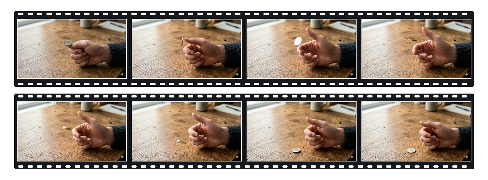

# PAWBench: How Far Are We from Probabilistically Aligned World Modeling?

<p align="center">
  <a href="#citation">
    
  </a>
  <a href="#citation">
    
  </a>
  <a href="#overview">
    
  </a>
  <a href="https://huggingface.co/datasets/Andrew613/PAWBench">
    
  </a>
  <a href="#initial-results-pre-release">
    
  </a>
</p>

> [!WARNING]
> **Pre-release repository.** The evaluator and benchmark data are available for review. Paper links, the project page, and the public leaderboard will be added with the release.

## Overview

Physical processes are stochastic: the same action can end in more than one
valid state. PAWBench therefore asks whether a video generator reproduces a
*distribution* of physical outcomes across repeated rollouts, not whether it
can produce one convincing video.

<p align="center">
  
</p>

For each fixed source image and action, generate 50 videos. PAWEval reads each
rollout with a scene-specific rubric, then the official metrics aggregate the
resulting outcome labels.

| Track | Question | Metric |
| --- | --- | --- |
| **PAW-Calibration** | Are outcome frequencies correct? | TVD (lower is better) |
| **PAW-Coverage** | Are all supported outcomes observed? | Coverage (higher is better) |

The benchmark contains 50 scenes: 25 PAW-Calibration and 25 PAW-Coverage.
It ships 100 reviewable rubrics (one outcome rubric and one trustworthiness
rubric per scene). The two metrics remain separate; PAWBench does not turn
them into a single score.

## Visual examples

Each strip below is one generated rollout. PAWBench repeats the same source
image and action 50 times, reads one outcome from every rollout, and evaluates
the resulting distribution rather than judging a single video in isolation.
These two published HappyHorse rollouts illustrate the readout protocol; neither
single rollout is a model-level result.

### PAW-Calibration: Coin flip (`A-01`)

<p align="center">
  
</p>

**Action:** flick the coin once. This rollout is read as `heads`. Across 50
rollouts, the Head/Tail frequencies are compared with the scene's reference
distribution using TVD.

### PAW-Coverage: Ball Toss Into Cup (`BC-01`)

<p align="center">
  
</p>

**Action:** toss the ball once toward the cup. This rollout is read as
`clean_in_cup`. Across repeated rollouts, Coverage asks how many supported
outcomes the model recovers, including in-cup, contact-then-out, near-miss, and
clear-miss outcomes.

## Initial results (pre-release)

These are the current fixed-K=50, GT-guided reference runs under the same
current rubric setting. They are useful reference points, **not** a public
leaderboard: they do not compare base/no-prompt systems, and will be superseded
by the paper's released table.

| Model | PAW-Calibration TVD (%) ↓ | PAW-Coverage (%) ↑ |
| --- | ---: | ---: |
| Wan2.2 | 15.3 | 76.2 |
| MiniMax H3 | 10.8 | 82.9 |
| Cosmos 3 Super I2V | 12.8 | 87.3 |
| LTX-2.5 | 18.0 | 73.9 |

## Run PAWBench

The shortest workflow is: install the evaluator, download the data once,
generate your videos, then run the example.

### 1. Install

```bash
git clone https://github.com/Andrew0613/PAWBench.git
cd PAWBench

python -m venv .venv
source .venv/bin/activate
pip install -e ".[eval]"
```

### 2. Download the benchmark data

Choose where to keep the dataset, then download it there.

```bash
export PAWBENCH_DATA_DIR="$PWD/data/PAWBench"
pip install -U "huggingface_hub[cli]"
hf download Andrew613/PAWBench --repo-type dataset --local-dir "$PAWBENCH_DATA_DIR"
```

Afterward, the directory should contain `manifest.json`, `scenes.jsonl`,
`source_images/`, and `prompts/`. Keep this path: the example below reads it
through `PAWBENCH_DATA_DIR`.

### 3. Evaluate your videos

Use your own video generator on every source image/action pair and place its
rollouts in this simple layout:

```text
my-model-rollouts/
├── A-01/
│   ├── r000.mp4
│   └── ... r049.mp4
├── A-02/
│   └── ...
└── ...
```

The `evaluate()` API does not invoke a generator; it evaluates videos that are
already present on disk. You can generate them with your own system or use the
optional Diffusers example below.

#### Optional: generate rollouts with Diffusers

If your image-to-video model is available through Diffusers, the included
generation example can create the required directory layout directly. The
model ID is explicit and replaceable; the example does not maintain a model
registry.

```bash
pip install -e ".[generate]"

# Validate a one-scene, one-rollout smoke plan without loading the model.
python examples/generate_diffusers.py \
  --benchmark "$PAWBENCH_DATA_DIR" \
  --output "$PWD/my-model-rollouts" \
  --model-id Wan-AI/Wan2.1-I2V-14B-480P-Diffusers \
  --scene A-01 \
  --num-rollouts 1 \
  --dry-run
```

Remove `--dry-run` to generate the video. Different compatible Diffusers
image-to-video checkpoints can be selected with `--model-id`. Model downloads
and GPU requirements depend on the selected checkpoint. A complete PAWBench
run uses `--all-scenes --num-rollouts 50`, producing 2,500 videos; start with
the smoke example before committing that compute.

#### Evaluate generated or existing rollouts

The evaluator only needs the completed rollout directory, regardless of how
the videos were generated:

```bash
export PAWBENCH_RESULTS_DIR="$PWD/my-model-rollouts"
export PAWBENCH_MODEL="my-model"

# The OpenAI-compatible VLM used by PAWEval.
export PAWBENCH_VLM_BASE_URL="https://your-vlm-provider.example/v1"
export PAWBENCH_VLM_MODEL="your-vlm-model"
export PAWBENCH_VLM_API_KEY="..."

python examples/quickstart.py
```

[`examples/quickstart.py`](examples/quickstart.py) discovers the rollout
layout above and calls `evaluate()` with your paths, model name, and VLM
configuration. [`examples/generate_diffusers.py`](examples/generate_diffusers.py)
is the matching optional generator example. Both remain editable examples
rather than a submission system or model registry.

## Python API

The public package exposes exactly two functions:

```python
from pawbench import compute_metrics, evaluate
```

`evaluate(benchmark_path, videos, *, model_or_lane, vlm)` runs the complete
local evaluation journey. `compute_metrics(rows, scene_policy)` calculates the
official metrics from existing judgment rows without decoding media or calling
a VLM.

`pawbench/paweval/` remains fully visible for review: it loads the two rubrics,
samples video frames, renders the judgment instructions, calls an
OpenAI-compatible VLM, and parses its structured response. It is an
implementation detail rather than a second public judge SDK.

## Repository layout

```text
pawbench/
├── __init__.py             # public API: evaluate, compute_metrics
├── evaluation.py           # complete local evaluation journey
├── metrics.py              # official deterministic metrics
└── paweval/                # rubrics, evidence preparation, VLM judgment
examples/                   # Diffusers generation and evaluation examples
assets/                     # README figures
tests/                      # public-contract and evaluator checks
```

## Citation

The paper and canonical citation will be added with the public release. Until
then, cite the exact repository commit used for an evaluation.

## License

PAWBench is released under the [Apache License 2.0](LICENSE).
